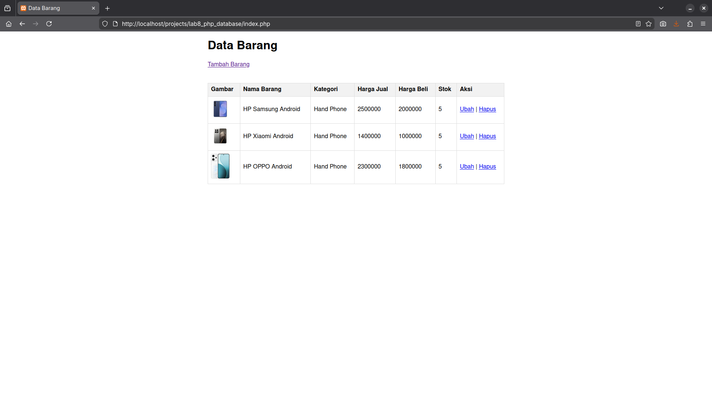
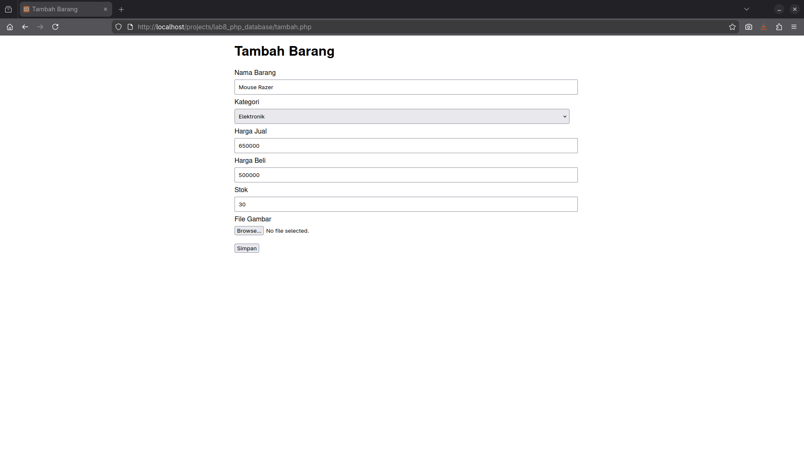
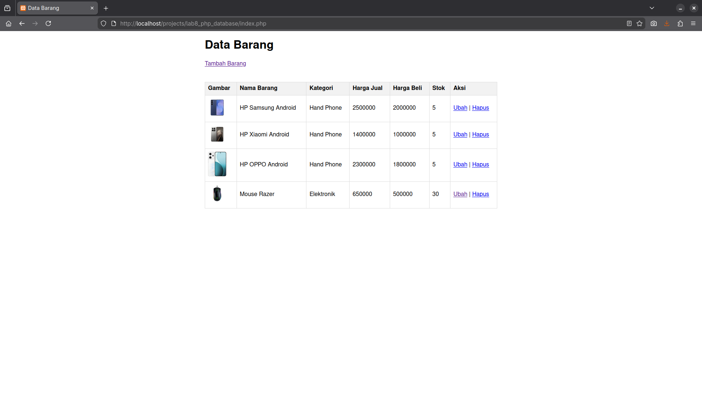
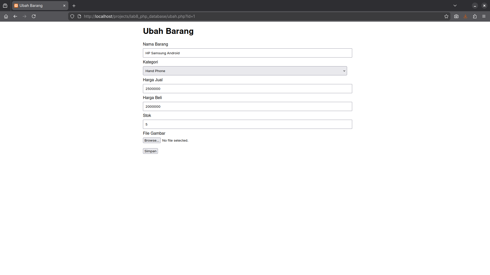
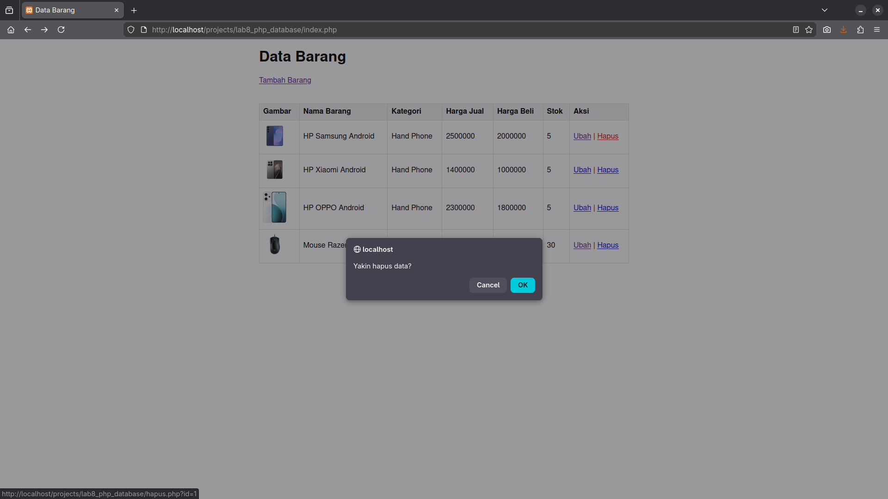

# Praktikum 8 - PHP & MySQL (CRUD Data Barang)

Repositori ini berisi implementasi praktikum 8 mata kuliah Pemrograman Web,
yang membahas cara membuat aplikasi CRUD sederhana menggunakan PHP dan MySQL.

## Fitur Utama
- Menampilkan daftar barang dari database  
- Menambah data barang  
- Mengubah data barang  
- Menghapus data barang  
- Upload gambar barang  
- Tampilan tabel sederhana menggunakan HTML  


---

## Struktur Database

### Tabel: `data_barang`

| Field        | Tipe Data        |
|--------------|------------------|
| id_barang    | INT AUTO_INCREMENT PRIMARY KEY |
| kategori     | VARCHAR(50)      |
| nama         | VARCHAR(100)     |
| gambar       | VARCHAR(255)     |
| harga_beli   | INT              |
| harga_jual   | INT              |
| stok         | INT              |

---

## Cara Menjalankan Project

1. Clone repository:
   ```bash
   git clone https://github.com/dnrprsty/Lab08Web
2. Pindahkan ke :
   ```bash
   /opt/lampp/htdocs/
3. Buat database di phpMyAdmin
   Import data atau buat tabel sesuai struktur di atas.
4. Jalankan Projek :
   ```bash
   http://localhost/Lab8Web/
---
# Web Snapshot
Tampilan Home

Menambahkan Barang


Mengedit Barang

Menghapus Barang

